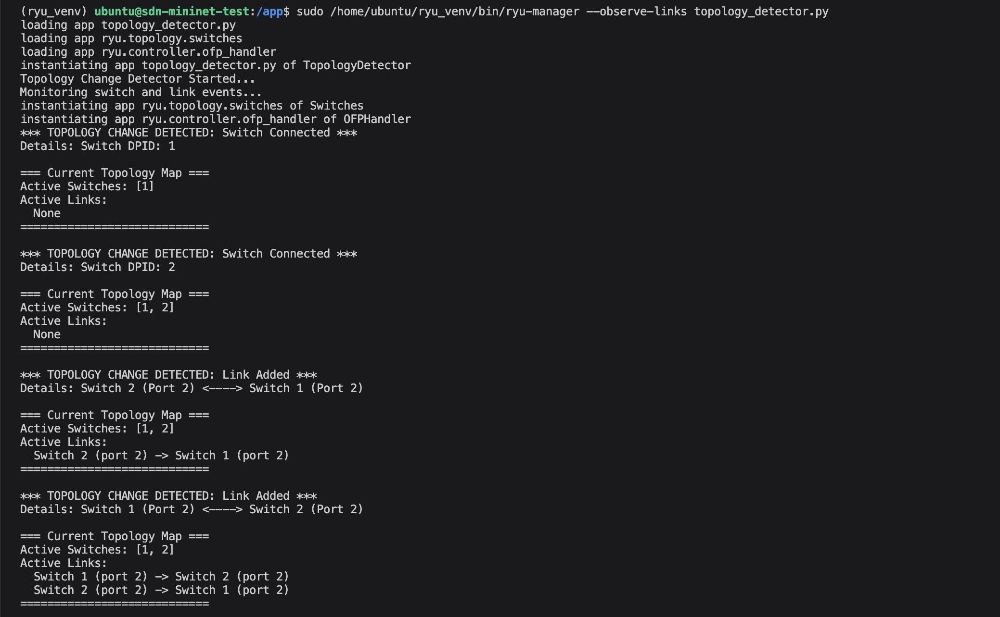
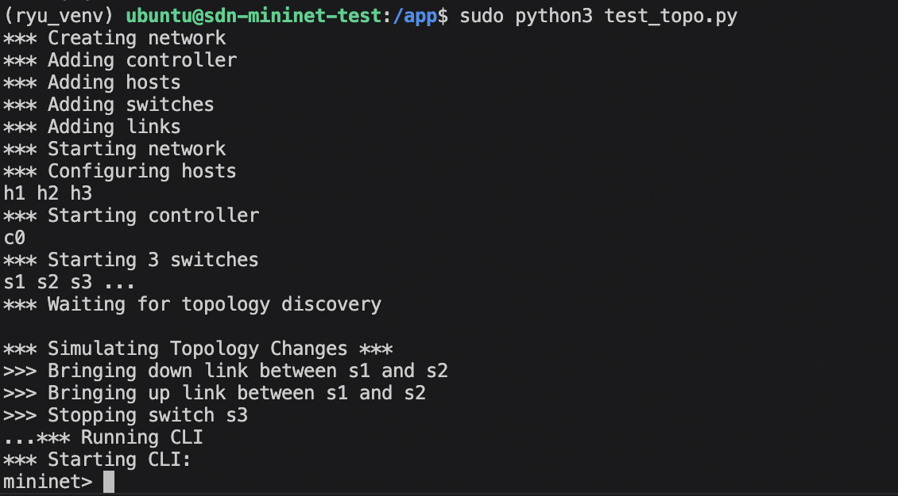
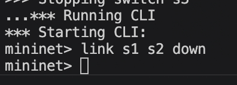
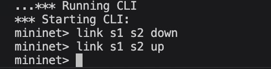
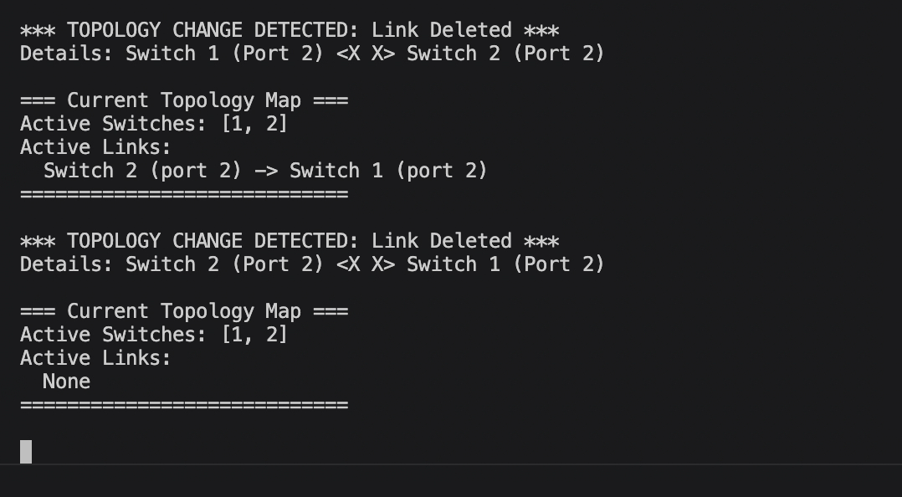
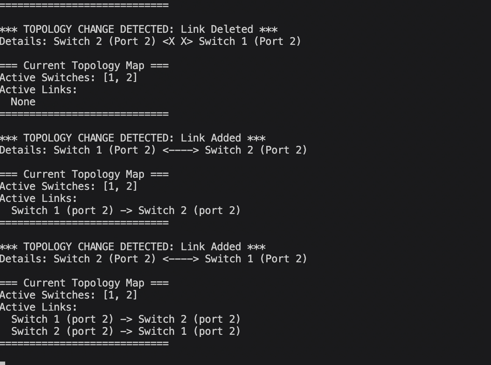

# SDN Topology Change Detector

This repository contains a Ryu-based SDN controller application that dynamically detects changes in your network topology (e.g. switch connections, disconnections, link additions, and link failures). This was done for the Mininet assignment for the course Computer Networks.

Author - **Anirudh Ramesh**

SRN - **PES1UG24CS929**

Section - **4k**

## Features Implemented Based on Requirements:
- **Monitor switch/link events:** Listens for `EventSwitchEnter`, `EventSwitchLeave`, `EventLinkAdd`, and `EventLinkDelete`.
- **Update topology map:** Maintains an internal state of connected switches and links.
- **Display changes:** Prints the updated topology map to the console whenever an event occurs.
- **Log updates:** Logs a clear message detailing the exact nature of the change.

## Prerequisites
- **Requirements:** Run the following commands in the project directory to install all the dependencies.
```zsh
pip install -r requirements.txt
```
- **Mininet:** Installed on the system.
- A virtual machine with Ubuntu 20.04 is recommended, this hasn't been tested on other versions
- For the purposes of this demonstration, I'm using Multipass.

## How to Run the Demonstration

You will need two terminal windows.

### Terminal 1: Run the Ryu Controller
You must use the `--observe-links` flag to instruct Ryu's build-in topology discovery application to send out LLDP packets and monitor links.
```zsh
ryu-manager --observe-links topology_detector.py
```

### Terminal 2: Run the Mininet Simulation
A custom test script has been provided that automatically creates a network and simulates link failures and switch disconnections. Run this with `sudo`:
```zsh
sudo python3 test_topo.py
```
- Note, test_topo.py has some preliminary tests before the Mininet CLI actually runs, I'd say give it around
a minute.
- In the CLI, you can run `link s1 s2 down` to remove those links, and `link s1 s2 up` to bring them back up. The test_topology.py has only 3 hosts connected to 3 switches, and these switches are connected amongst each other. Feel free to modify the network structure 

### Expected Output
In the Terminal 1 window, you will see output like this as the network starts and Mininet simulates failures:
```text
[INFO] Topology Change Detector Started...
[INFO] *** TOPOLOGY CHANGE DETECTED: Switch Connected ***
[INFO] Details: Switch DPID: 1
...
[INFO] === Current Topology Map ===
[INFO] Active Switches: [1, 2, 3]
[INFO] Active Links:
[INFO]   Switch 1 (port 2) -> Switch 2 (port 2)
[INFO]   Switch 2 (port 3) -> Switch 3 (port 2)
[INFO] ============================
...
[INFO] *** TOPOLOGY CHANGE DETECTED: Link Deleted ***
[INFO] Details: Switch 1 (Port 2) <X X> Switch 2 (Port 2)
...
[INFO] *** TOPOLOGY CHANGE DETECTED: Switch Disconnected ***
[INFO] Details: Switch DPID: 3
```

### Screenshots
- #### Initialising the detector


- #### Running the tester and setting up the base topology



- #### Mininet CLI



- #### Remaining tests






